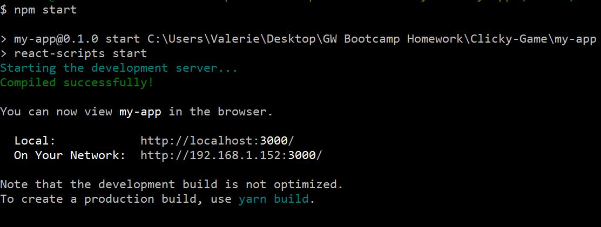
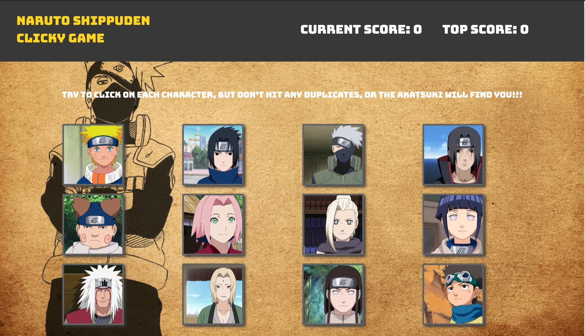

## Clicky-Game
GW Homework Week 19

#### Test your memory with your favorite shinobi from *Naruto*.

This app is a memory game, as the user must click on each character once to win the game. But if the user clicks on a character twice, the game is over and restarts.

#### Built with React. Check it out [here](https://github.com/valfragier16/Clicky-Game).

<h2>Demo</h2>
Clicky-Game is deployed to Heroku. Please check it out <a href="https://newsscrapper18.herokuapp.com/" target="_blank">here</a>.

<h2>Installation</h2>
To install the application follow the instructions below:
<ol>
    <li>git clone git@github.com:valfragier16/Clicky-Game.git</li>
    <li>cd Clicky-Game</li>
    <li>npm install</li>

<h2>Run Locally</h2>
Once you have completed the installation, to access the application in your browser, first run <i>npm start<s/i> in your terminal within the <i>Clicky-Game</i> folder.

If done properly, your terminal should display the following, which will include a list of articles and their links:

<h2>Application</h2>

The app will look like the image below:

